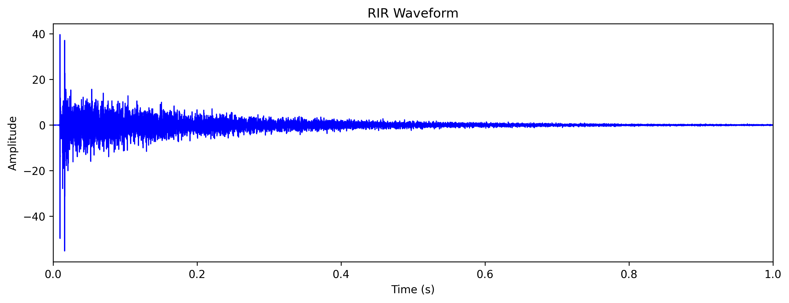

## Position of Mic array

## Waveform Analysis

## How to define the start of Direct Sound?

Lower the sampling rate, there will be special pattern of the phase

## How to align two RIRs?

Method 1: Phase alignment

Method 2: Maximize Cross-correlation

Method 2.1: Maximize Local Cross-correlation

Method 3: Peak alignment

## How to devide early reflections and late reflections?

energy decay curve (EDC)

The early echo time decrease as the sampling rate increase(Going to find a way to solve it). And the threshold is hard to determin.

## DTW

## POT